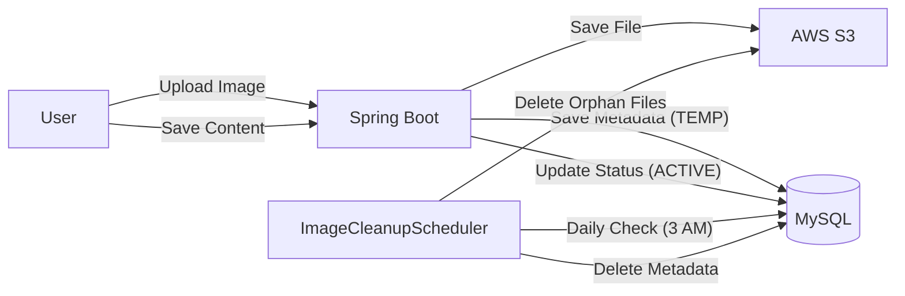

# ✈️ TripBuddy (트립버디)

> 함께 계획하고, 공유하고, 떠나는 올인원 여행 플랫폼
> 

**TripBuddy**는 여행 정보 공유(커뮤니티)와 동행 간의 실시간 여행 계획 협업(플래너)을 제공하는 백엔드 API 서비스입니다.

단순한 CRUD를 넘어 **대용량 트래픽과 동시성 문제, 리소스 효율화**를 고려하여 설계되었습니다.

---

## 📚 목차

1. 프로젝트 소개
2. 주요 기능 및 기술적 특징
3. 기술 스택
4. 시스템 아키텍처
5. 실행 방법
6. API 문서

---

## 📝 프로젝트 소개

TripBuddy는 단순한 여행 정보 공유를 넘어, 사용자 간의 상호작용과 데이터의 효율적 관리에 초점을 맞춘 프로젝트입니다.

여행 정보를 공유하는 블로그 기능과 WebSocket을 활용한 실시간 협업 여행 플래너를 통해 여행의 준비부터 기록까지의 모든 과정을 지원합니다.

- **개발 기간:** 2024.XX ~ 2024.XX (진행 중)
- **개발 인원:** 1명 (백엔드)

---

## ✨ 주요 기능 및 기술적 특징

### 1. 🔐 인증 및 사용자 관리 (Auth)

- **JWT 기반 인증:** Access Token과 Refresh Token을 활용한 보안 강화 및 Stateless 인증 구현.
- **커스텀 필터:** `LoginFilter`와 `JwtFilter`를 통해 인증 프로세스 세분화 및 예외 처리.
- **회원가입:** 비밀번호 암호화(BCrypt) 및 이메일/닉네임 중복 검증.

### 2. 📝 콘텐츠 관리 (Contents)

- **게시글 CRUD:** 여행 팁(TIP)과 리뷰(REVIEW) 카테고리별 게시글 작성 및 조회.
- **마크다운 이미지 처리:** 본문 내 이미지 URL 추출 및 관리 로직 구현.
- **이미지 생명주기 관리:** - 게시글 작성 시 이미지는 `TEMP` 상태로 업로드.
    - 게시글 저장 시 실제 사용된 이미지만 `ACTIVE` 상태로 전환.
    - **스케줄러:** 매일 새벽 3시에 고아 객체(사용되지 않는 `TEMP` 이미지)를 S3와 DB에서 자동 삭제하여 스토리지 비용 절감 (`ImageCleanupScheduler`).

### 3. 💬 소통 및 반응 (Interaction)

- **댓글 시스템:** 게시글에 대한 댓글 작성, 수정, 삭제 기능.
- **좋아요(Like):** 게시글 및 댓글에 대한 좋아요 토글 기능 및 카운트 동기화.

### 4. 🗺️ 실시간 협업 여행 플래너 (Real-Time Planner)

- **WebSocket & STOMP:** 여행 일정을 여러 명이 동시에 편집할 수 있도록 양방향 통신을 구현했습니다.
    - **Pub/Sub 모델:** 특정 여행 방(`Plan`)을 구독한 사용자들에게만 변경 사항을 실시간으로 브로드캐스팅합니다.
- **동시성 제어 (Concurrency Control):** 다수의 사용자가 동시에 같은 일정을 수정할 때 발생하는 데이터 덮어쓰기(Lost Update) 문제를 방지하기 위해 **낙관적 락(Optimistic Lock, `@Version`)**을 적용했습니다.
- **초대 시스템:** UUID 기반의 고유 초대 코드를 생성하여 간편하게 멤버를 플랜에 초대할 수 있습니다.
- **정확한 예산 관리:** 부동소수점 오차 없는 정확한 돈 계산을 위해 `BigDecimal` 타입을 사용하여 여행 경비(Budget)를 관리합니다.

### 5.🧩 확장성 있는 도메인 설계

- **Enum 활용:** `ContentType`(TIP, REVIEW), `RoleType`(USER, ADMIN), `ImageStatus` 등을 Enum으로 관리하여 Type Safety 보장.
- **Converter:** `StringToContentTypeConverter`를 통해 URL 파라미터를 Enum으로 자동 변환하여 컨트롤러 코드 간소화.

---

## 🛠 기술 스택

| **분류** | **기술** | **비고** |
| --- | --- | --- |
| **Language** | Java 21 | Latest LTS |
| **Framework** | Spring Boot 3.5.3 | Web, Validation, Security |
| **Database** | MySQL 8.0, H2 | Production / Test |
| **ORM** | Spring Data JPA | Hibernate |
| **Security** | Spring Security, JWT | Authentication |
| **Storage** | AWS S3 | Image Hosting |
| **Real-time** | WebSocket (STOMP) | Messaging Protocol |
| **Testing** | JUnit 5, Mockito | Unit/Integration Test |
| **Docs** | Swagger (SpringDoc) | API Documentation |

---

## 🏗 시스템 아키텍처



---

## 🚀 실행 방법

### 1. 사전 요구사항 (Prerequisites)

- Java 21 이상
- MySQL 8.0 이상
- AWS 계정 (S3 버킷 생성 및 Access Key 발급 필요)

### 2. 환경 변수 설정 (.env)

프로젝트 루트 경로에 `.env` 파일을 생성하거나 환경 변수를 설정해야 합니다.

Properties

```
# Server
SERVER_PORT=8080

# Database (MySQL)
SPRING_DATASOURCE_URL=jdbc:mysql://localhost:3306/tripbuddy
SPRING_DATASOURCE_USERNAME=root
SPRING_DATASOURCE_PASSWORD=your_password

# JWT Token Config
JWT_SECRET_KEY=your_base64_secret_key_here
JWT_ACCESS_EXP_TIME=3600000
JWT_REFRESH_EXP_TIME=86400000

# AWS S3 Config
CLOUD_AWS_CREDENTIALS_ACCESS_KEY=your_aws_access_key
CLOUD_AWS_CREDENTIALS_SECRET_KEY=your_aws_secret_key
CLOUD_AWS_REGION_STATIC=ap-northeast-2
CLOUD_AWS_S3_BUCKET=your_bucket_name
```

### 3. 빌드 및 실행

Bash

```bash
# Clone Repository
git clone https://github.com/your-username/tripbuddy.git

# Build
./gradlew build

# Run
./gradlew bootRun
```

---

## 📘 API 문서

서버 실행 후 아래 주소에서 Swagger UI를 통해 API 문서를 확인할 수 있습니다.

- **URL:** `http://localhost:8080/swagger-ui/index.html`

---

## 🤝 Contributing

이 프로젝트는 개인 학습 및 포트폴리오 목적으로 개발되었습니다. 버그 리포트나 기능 제안은 Issue를 통해 환영합니다.

---

**Contact:** 박연준 (hnn06134@gmail.com)
