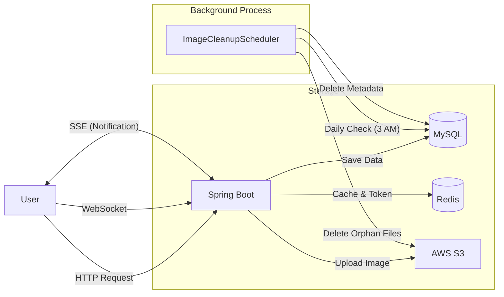

# ✈️ TripBuddy (트립버디)

> 함께 계획하고, 공유하고, 떠나는 올인원 여행 플랫폼
> 

**TripBuddy**는 여행 정보 공유(커뮤니티)와 동행 간의 실시간 여행 계획 협업(플래너)을 제공하는 고성능 백엔드 API 서비스입니다.

단순한 CRUD를 넘어 **대용량 트래픽 처리, 동시성 제어, 리소스 효율화, 실시간성**을 고려하여 설계되었습니다.

---

## 📚 목차

1. 프로젝트 소개
2. 주요 기능 및 기술적 특징
3. 기술 스택
4. 시스템 아키텍처
5. 실행 방법
6. API 문서

---

## 📝 프로젝트 소개

TripBuddy는 사용자가 여행 정보를 기록하는 블로그 기능과, 친구들과 실시간으로 여행 일정을 계획하는 플래너 기능을 통합한 플랫폼입니다.

기존의 수동적인 초대 방식(코드 공유)을 탈피하고, **실시간 알림(SSE)과 WebSocket을 활용한 능동적인 협업 환경**을 구축하는 데 초점을 맞추었습니다.

- **개발 기간:** 2024.XX ~ 2024.XX (진행 중)
- **개발 인원:** 1명 (백엔드)

---

## ✨ 주요 기능 및 기술적 특징

### 1. 🔐 인증 및 보안 (Auth & Security)

- **JWT & Redis:** Access Token으로 인증하고, Refresh Token은 **Redis**에 저장하여 보안과 성능을 동시에 확보했습니다.
    - **TTL(Time-To-Live) 적용:** `@RedisHash`를 사용하여 만료된 Refresh Token이 자동으로 삭제되도록 구현, DB 관리 비용을 최소화했습니다.
- **커스텀 필터 체인:** `LoginFilter`와 `JwtFilter`를 통해 인증 프로세스를 세분화하고 예외를 체계적으로 처리합니다.

### 2. 🗺️ 실시간 협업 여행 플래너 (Real-Time Planner)

- **WebSocket & STOMP:** 여행 일정을 여러 명이 동시에 편집할 수 있도록 양방향 통신을 구현했습니다.
    - **Pub/Sub 모델:** 특정 여행 방(`Plan`)을 구독한 사용자들에게만 일정 추가/변경 사항을 실시간으로 브로드캐스팅합니다.
- **초대 시스템 고도화 (Invitation & SSE):**
    - 기존의 번거로운 초대 코드 방식을 폐기하고, **닉네임 검색 기반의 능동적 초대**로 개선했습니다.
    - **SSE (Server-Sent Events):** `NotificationService`를 통해 초대받은 사용자에게 실시간으로 알림을 전송하며, 수락/거절을 통해 `PlanMember`로 합류합니다.
- **동시성 제어 (Optimistic Lock):** 다수의 사용자가 동시에 같은 일정을 수정할 때 발생하는 데이터 덮어쓰기(Lost Update)를 방지하기 위해 `@Version`을 이용한 낙관적 락을 적용했습니다.
- **정확한 예산 관리:** 부동소수점 오차 없는 `BigDecimal` 타입을 사용하여 여행 경비(Budget)를 정밀하게 관리합니다.

### 3. 📝 콘텐츠 및 이미지 관리 (Content & Image)

- **이미지 생명주기 관리 (Image Lifecycle):**
    - **임시 저장 (Temp):** 이미지 업로드 시 즉시 S3에 저장하고 `TEMP` 상태로 관리.
    - **영구 저장 (Active):** 게시글 저장 시 실제 사용된 이미지면 `ACTIVE`로 전환.
    - **자동 정리 (Cleanup):** `ImageCleanupScheduler`가 매일 새벽 3시에 실행되어, 고아 객체(24시간 지난 `TEMP` 이미지)를 S3와 DB에서 일괄 삭제합니다.
- **마크다운 지원:** 게시글 본문 내 이미지 URL 추출 및 관리 로직을 정규식으로 구현했습니다.

### 4. 💬 소통 및 반응 (Interaction)

- **댓글 시스템:** 게시글에 대한 댓글 작성/수정/삭제 기능을 제공합니다.
- **좋아요 (Like):** 게시글 및 댓글에 대한 좋아요 토글 기능 (중복 방지 로직 포함).

---

## 🛠 기술 스택

| **분류** | **기술** | **비고** |
| --- | --- | --- |
| **Language** | Java 21 | Latest LTS |
| **Framework** | Spring Boot 3.5.3 | Web, Security, Validation |
| **Database** | MySQL 8.0, H2 | Production / Test |
| **Cache/NoSQL** | **Redis** | Refresh Token, Caching |
| **ORM** | Spring Data JPA | Hibernate |
| **Security** | Spring Security, JWT | Authentication |
| **Storage** | AWS S3 | Image Hosting |
| **Real-time** | **WebSocket (STOMP), SSE** | Collaboration, Notification |
| **Testing** | JUnit 5, Mockito | Unit/Integration Test |
| **Docs** | Swagger (SpringDoc) | API Documentation |

---

## 🏗 시스템 아키텍처

코드 스니펫



---

## 🚀 실행 방법

### 1. 사전 요구사항 (Prerequisites)

- Java 21 이상
- MySQL 8.0 이상
- Redis (로컬 또는 Docker)
- AWS 계정 (S3 버킷 생성 및 Access Key 발급 필요)

### 2. 환경 변수 설정 (.env)

프로젝트 루트 경로에 `.env` 파일을 생성하거나 환경 변수를 설정해야 합니다.

```yaml
# Server
SERVER_PORT=8080

# Database (MySQL)
SPRING_DATASOURCE_URL=jdbc:mysql://localhost:3306/tripbuddy
SPRING_DATASOURCE_USERNAME=root
SPRING_DATASOURCE_PASSWORD=your_password

# Redis
SPRING_DATA_REDIS_HOST=localhost
SPRING_DATA_REDIS_PORT=6379

# JWT Token Config
JWT_SECRET_KEY=your_base64_secret_key_here
JWT_ACCESS_EXP_TIME=3600000
JWT_REFRESH_EXP_TIME=86400000

# AWS S3 Config
CLOUD_AWS_CREDENTIALS_ACCESS_KEY=your_aws_access_key
CLOUD_AWS_CREDENTIALS_SECRET_KEY=your_aws_secret_key
CLOUD_AWS_REGION_STATIC=ap-northeast-2
CLOUD_AWS_S3_BUCKET=your_bucket_name
```

### 3. 빌드 및 실행

Bash

```bash
# Clone Repository
git clone https://github.com/your-username/tripbuddy.git

# Build
./gradlew build

# Run
./gradlew bootRun
```

---

## 📘 API 문서

서버 실행 후 아래 주소에서 Swagger UI를 통해 API 문서를 확인할 수 있습니다.

- **URL:** `http://localhost:8080/swagger-ui/index.html`

---

## 🤝 Contributing

이 프로젝트는 개인 학습 및 포트폴리오 목적으로 개발되었습니다.

코드 컨벤션은 docs/CODE_CONVENTION.md를 참고해 주세요.

---

**Contact:** 박연준 (hnn06134@gmail.com)
